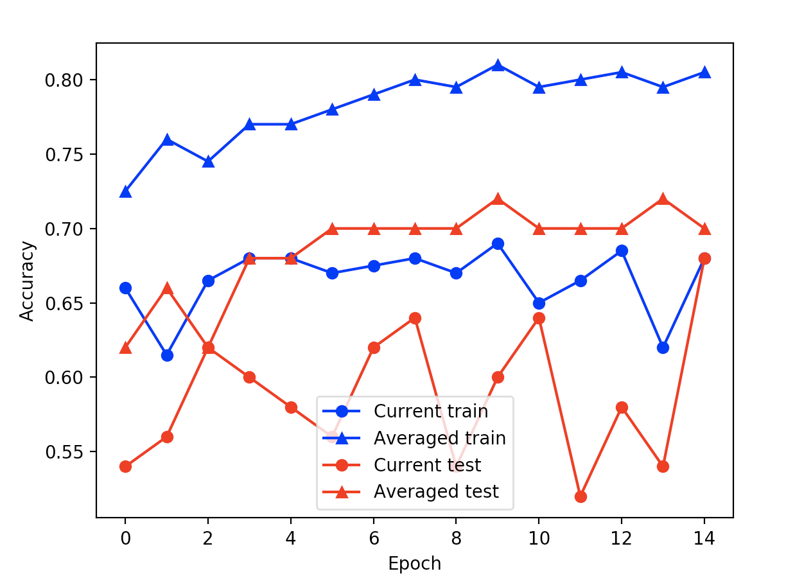

# Linear Classifier Perceptron Learning
#### Author: Nora Myer
#### Date: Feb. 2019

Using training data and perceptron learning to build a model to decide which game to play based on game attributes details in *game_attributes.txt*.

## Running dependencies
- Version of python3
- python3 compatible version of numpy
- Tested on linux and mac environments
- matplotlib.pyplot package

```
$python3 linearly-classify.py
```

## Results
For each epoch, the accuracy results for both the current model and the averaged model are calculated for both the training and test data sets and printed to the console. Then the training and test accuracies for the two models over each epoch are plotted, with blue representing training data accuracies, red representing test data accuracies, circle's representing the current model, and triangles representing the averaged model.


